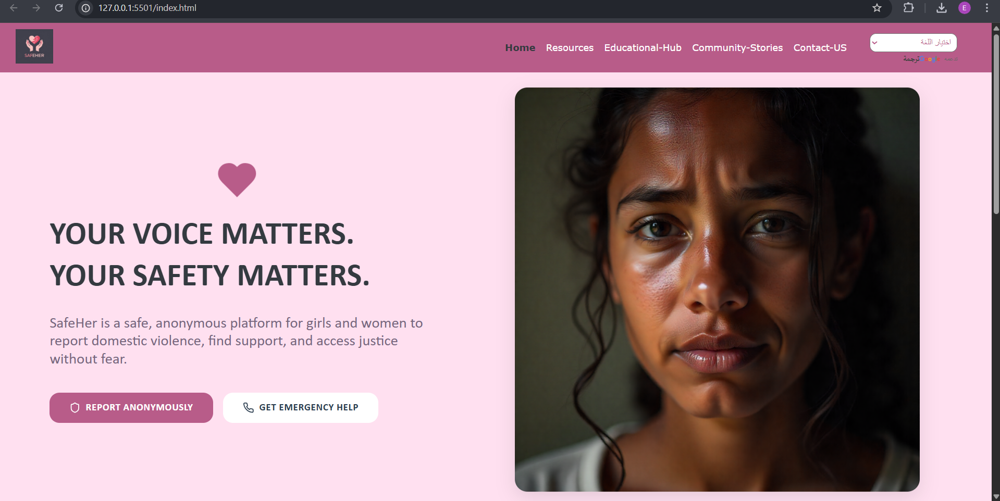
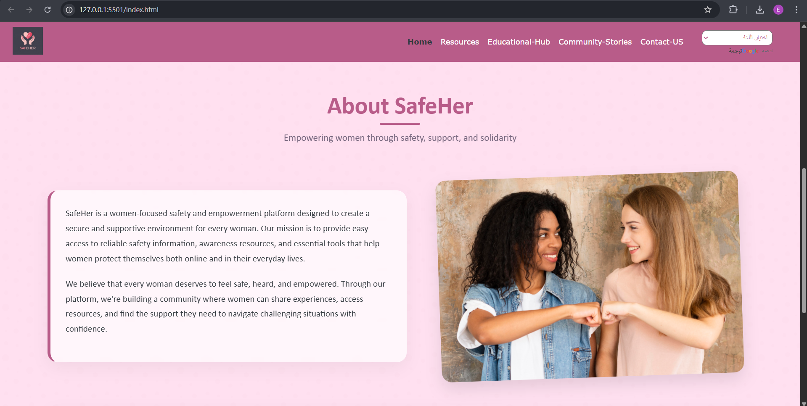
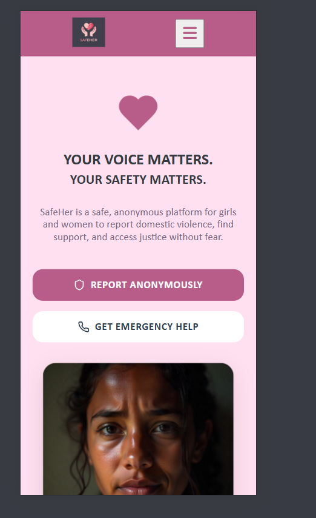
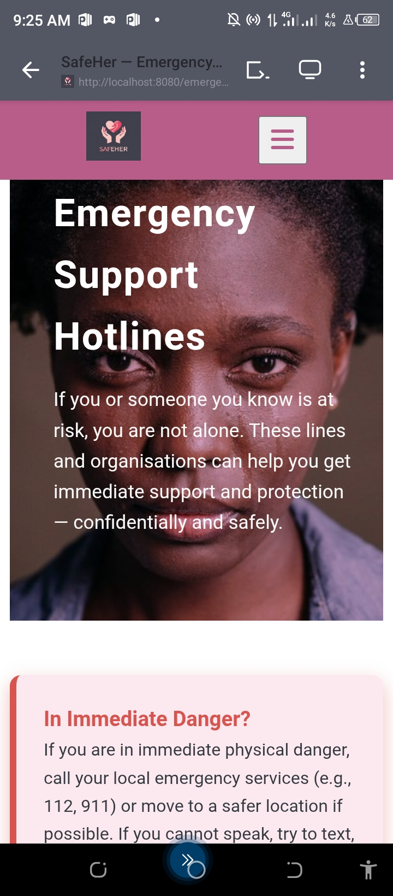

# CodeCrafter – Women Techsters Bootcamp 2025  
### *Group 2 — Software Development & Technical Project Management Track*

> **“Every woman deserves safety. Every girl deserves a voice. Every story deserves to be heard.”**


[Visit SafeHer Website](https://safeher-ten.vercel.app/)
---

## 🌍 Overview

**CodeCrafter** is a collaborative class project built by **Group 2** of the *Software Development and Technical Project Management* students at the **Women Techsters Bootcamp 2025**.  
The platform is designed as an accessible, modern, and user-friendly showcase website demonstrating teamwork, technical skills, and the ability to deliver polished digital solutions.

The project reflects global accessibility, a professional UI/UX approach, responsive design, and clean implementation that aligns with modern web development standards.

---

## 🔑 Key Features

### ✅ Multilingual Support  
Users can seamlessly switch the website to their preferred language, ensuring global inclusiveness.

### ✅ Fully Responsive UI  
Optimized for mobile, tablet, and desktop to guarantee usability across all screen sizes.

### ✅ Modern Web Interface  
A clean, structured layout with intuitive navigation and visually appealing styling.

### ✅ High Accessibility Standards  
Readable texts, scalable layouts, and user-friendly interface.

### ✅ Team Collaboration  
Developed by Group 2 using version control, proper documentation, and shared development workflow.

---

## 📁 Project Structure

```
project-root/
│
├── css/
│   └── pageName.css
│
├── js/
│   └── pageName.js
│
├── images/
│   └── imageName.png
│
├── index.html && *.html(All html pages)
└── README.md
```

---

## 🚀 Getting Started

### Clone the Repository

```bash
git clone https://github.com/your-username/SafeHer.git
```

### Open the Project

```bash
open index.html
```

---

## 📸 Screenshots






---

## 📦 Deployment

The project can be deployed on:

- GitHub Pages  
- Netlify  
- Vercel  

Steps for GitHub Pages:

1. Push project to GitHub  
2. Go to **Settings**  
3. Scroll to **Pages**  
4. Select branch: `main`  
5. Set folder: `/root`  
6. Save and publish  

---

## 🤝 Contribution Guidelines

1. Fork the repository  
2. Create a new branch  
3. Make your changes  
4. Commit and push  
5. Open a pull request  

---

## 👩‍💻 Team Members

**CodeCrafter – Group 2**  
Software Development & Technical Project Management  
Women Techsters Bootcamp 2025  

---

## 👩 Author

**Philip Favour Boluwatife**

---

## 📄 License

Open-source and free for educational use.

---

## 🙏 Acknowledgements

- Women Techsters Bootcamp 2025  
- Facilitators and mentors  
- Team members  

---

## 📢 Contact

Reach out through your preferred communication channel.

---

